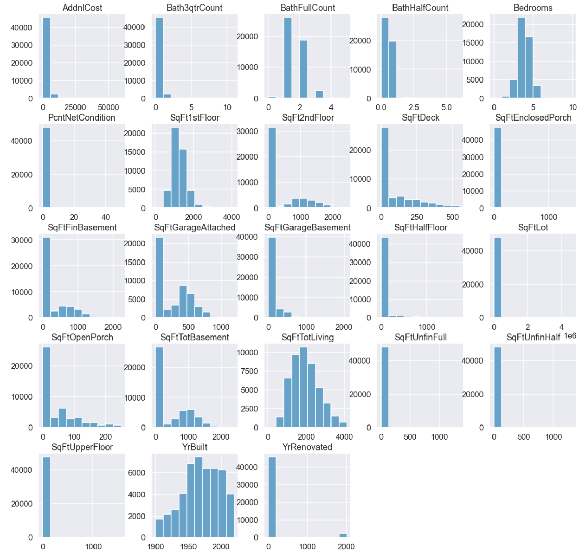
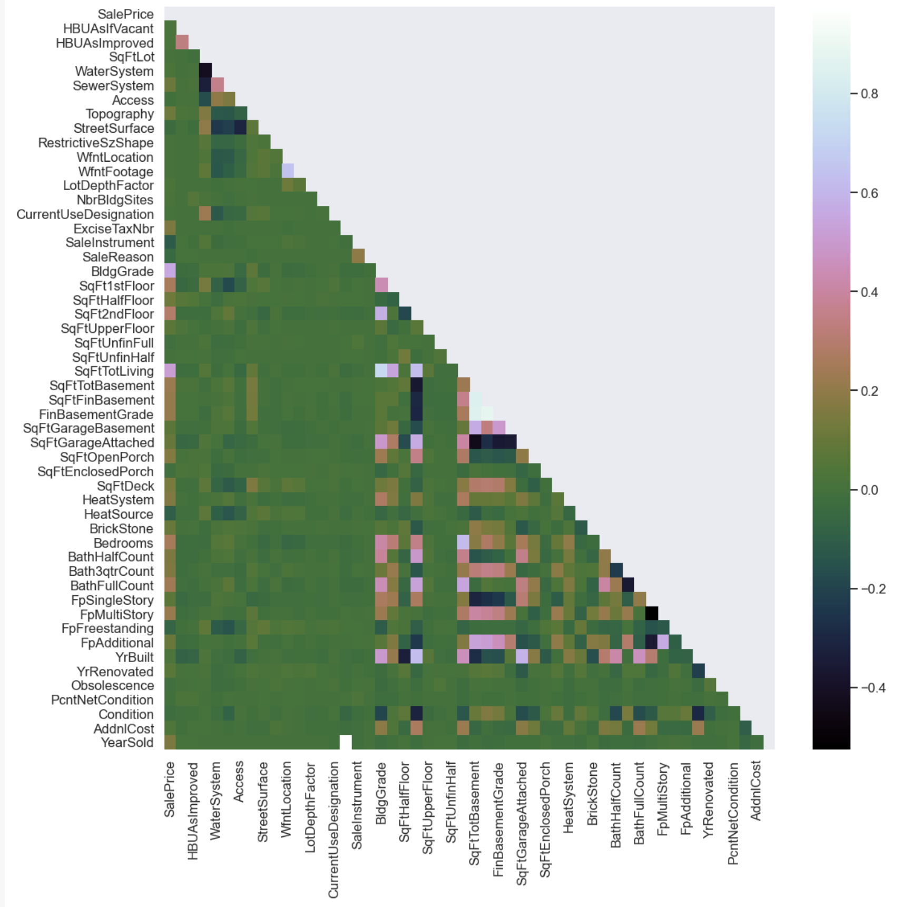
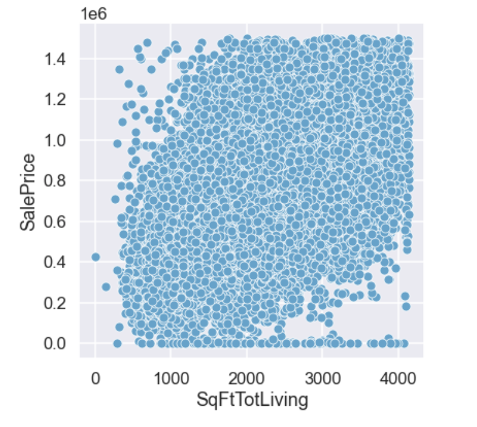
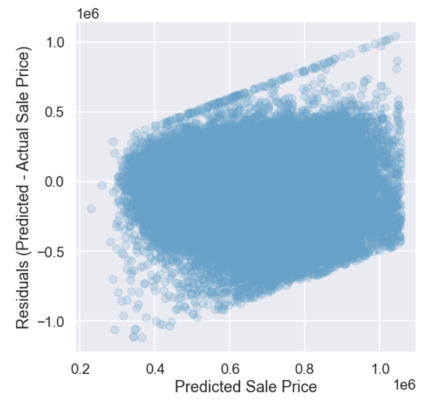
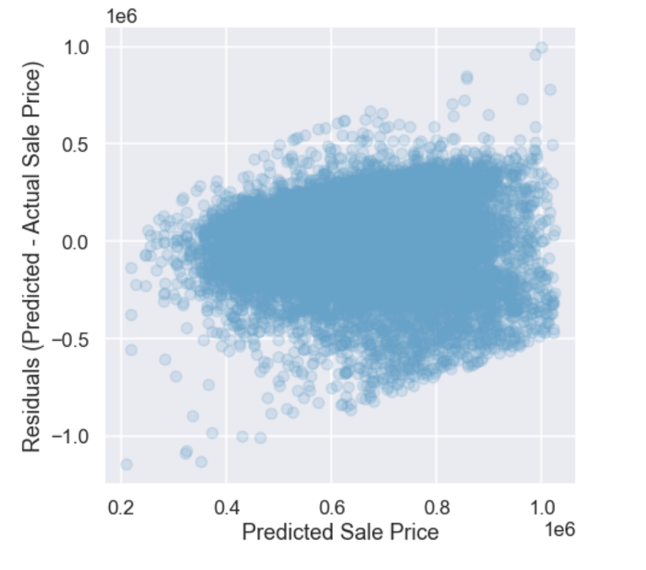
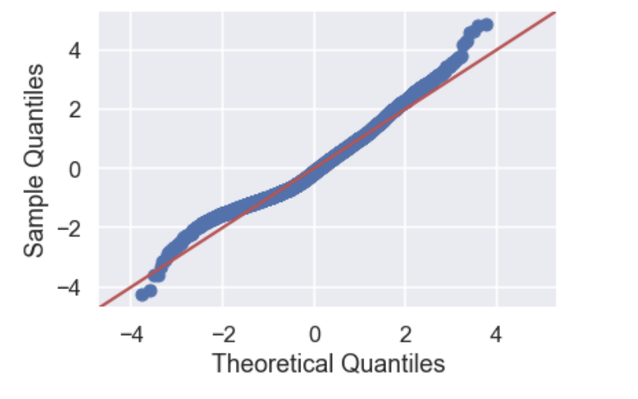
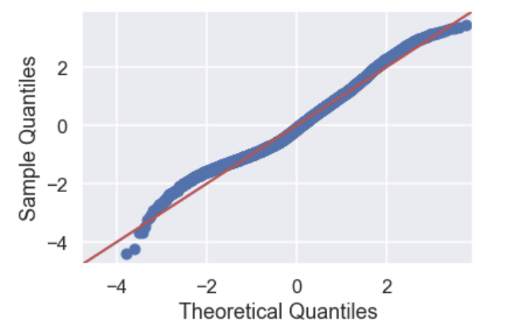

# King County Home Price Analysis

This repository offers an analysis of factors that influence housing prices in King County, WA

## This Repository

### Repository Directory

```
├── README.md        <-- Main README file explaining the project's business case,
│                        methodology, and findings
│
├── data             
│   ├── processed    <-- Processed (combined, cleaned) data used for modeling
│   └── raw          <-- Original (immutable) data dump
│
├── notebooks        
│   ├── exploratory  <-- Unpolished exploratory data analysis (EDA) notebooks
│   └── report       <-- Polished final notebook(s)
│
├── references       <-- Data dictionaries
│
└── reports          <-- Generated analysis (including presentation.pdf)
    └── figures      <-- Generated graphics and figures to be used in reporting
```

### Quick Links

1. [Data Preparation Notebook](notebooks/exploratory/data_preparation.ipynb)
2. [Final Analysis Notebook](notebooks/exploratory/KingsCountyHomePriceAnalysis.ipynb)
3. [Presentation Slides](reports/presentation.pdf)


## Business Understanding

A client in King County, WA wants to advise homeowners on **home improvement projects** that will **add to the sale value of their homes.**

## Data Understanding

The datasets for this projects were provided by **the Kings County Department of Assessments.** Three of the datasets contain **property data** and a fourth represents information about **administrative codes.** All **three datasets with property data were merged into one dataframe** in order to build baseline model.

To investigate the continious variables of the data closer, the **histograms** were plotted.



The histograms show that most of the variables are **not normally distributed** and are **positively skewed**. The columns `SqFt1stFloor`, `Bedrooms`, `YrBuilt` and `SqFtTotLiving` are the closest ones to **normal distributon.**

Considering that `SalePrice` is a target variable for the analysis, the **correlation matrix** and **heatmap** plot were built to find the features that are **most correlated with the target.**



Graph shows that **most correlated features** are `SalePrice`, `SqFtTotLiving`, `SqFt1stFloor`, `SqFt2ndFloor` and `BathFullCount`.

Lastly, to build a baseline model with only one feature that is the most correlated with target, the scatterplot was generated with target variable `SalePrice` and `SqFtTotLiving` feature.



The graph indeed shows **some sort of linearity** between a feature and a target.


## Data Preparation

Before building the first model, the data was **cleaned from outliers in continious variables**, like `SqFtOpenPorch`, `SqFtDeck`, `SqFtGarageAttached`, `SqFtTotBasement`, `SqFtTotLiving` with imported function. As for the target variable `SalePrice`, the outliers were **dropped using the box plot.**

After first linear regression baseline model with `SalePrice` as the target and `SqFtTotLiving` as a predictor, the **Error Plot** showed the **upward trend**, which migh be explained by the **distribution of sale years**. Thus, all **observations that are not from 2019 were dropped from dataframe.**




As the process of modeling progressed, a **square root transformation of target** `SalePrice` was done, which improved the model. While deeper investigation of the relationship between target and `SqFtTotLiving` feature,  **price per foot calculation** revealed another **set of outliers** that were later **dropped** from dataset. The result **improved the model's** `R-Square`.

## Modeling

A baseline model was built using simple linear regression with `SalePrice` as the target and `SqFtTotLiving` predictor. The model went through multiple reformations of predictors and the data. The final model was built using a forward selection method with 12 837 observations.

### The final model contained following predictors:
```
SqFtTotLiving_sqrt

SqFtEnclosedPorch

SqFtOpenPorch

Hot Water

Radiant

Elec BB

Gravity

Other (Heat System)
```
### Features that were dropped by forward selection method:
```
Forsed Air (dropped while encoding and included in target)

Heat Pump

Floor - Wall
```

### Coefficients of Final Model:

**Intercept**           -113564.804717

**SqFtTotLiving**         17511.216420

**x0_Hot_Water**         123454.424132

**x0_Radiant**           164864.870792

**x0_Elec_BB**           -40260.197573

**x0_Gravity**           185602.551453

**SqFtOpenPorch**           110.032856

**SqFtEnclosedPorch**       160.245880

**x0_Other**             101909.340237

## Evaluation

* The **coefficient of determination** in baseline model **increased from .272 to .3** in the final model. All **p-values** for the intercept and coefficients were **valid except for the **`Other` type of heating system. 
* The **linear relation p-value** in baseline model **decresed from 0.89 to 0.63** in final model, but still **holded the linearity assumption.**
* None of the models passed normality assuption, meaning the **residuals were not normally distributed**. But final model showed the **better results on the Q-Q Plot.**




* The **Jarque_Bera p-value** was small and indicated **heteroscadasticity in the residuals** for both of the models. 
* While the condition number of the final modelwas large, the Variance Inflation Factor values for the features show **no multicollinearity**, meaning the coefficients were lower than 5.0. 
* All of the coefficients in final model were positively correlated with target variable `SalePrice`, except the `Elec BB` Heat System type. Considering that "Forced Air" was included in Target, the Elec BB Heat System have the decrease in Sale Price in relation to "Forced Air".
* The intercept is smaller than all of the Forced Air heating when holding all other features constant. 
* While holding all other features constant, the coefficient for `SqFtTotLiving_sqrt` indicates that every one foot increase in living space will result in a \$17 500 increase in `SalePrice`.
* One square-foot increase in  SqFtOpenPorch, while other predictors remain constans, the SalePrice increases by $110. As for enclosed porch, Sale Price increases by $160.25.

**The final model showedd better results than the baseline model.**


## Conclusion

# Recommendations for Home Improvements

Based on the information of the final model, the following **home improvement projects are recommended** to imncrease sale price:
* **Enclose porch**, because the price of the house increses by $160 per square feet if the porch is enclosed.
* **Upgrade to Forced Air** system the Elec BB HeatSystems due to price increase.
* **Increase the square feet of Living Space**, because every foot upgrade increases house price by $17 500.


## Next Steps

* Further invastigate houses with fully open porches and fully enclosed porches. Find average price for both features.
* Increase the Living Space by converting BasementGarage to living area and invastigate how that would affect the sale price.
* Further analysis of heatsytem to calculate average sale price for each heatsytem.

